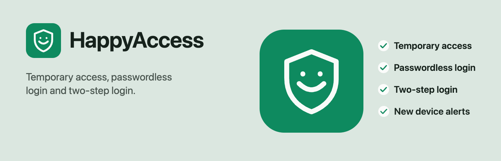
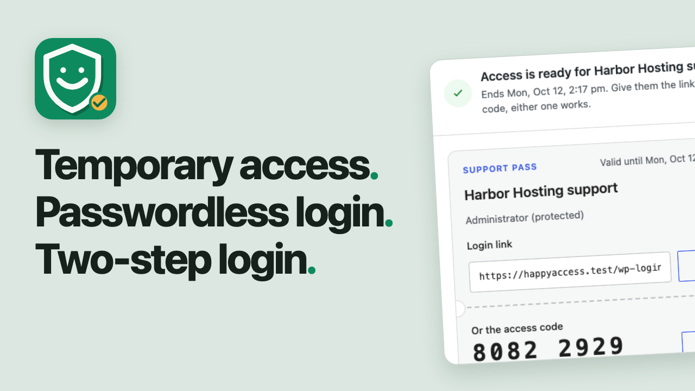
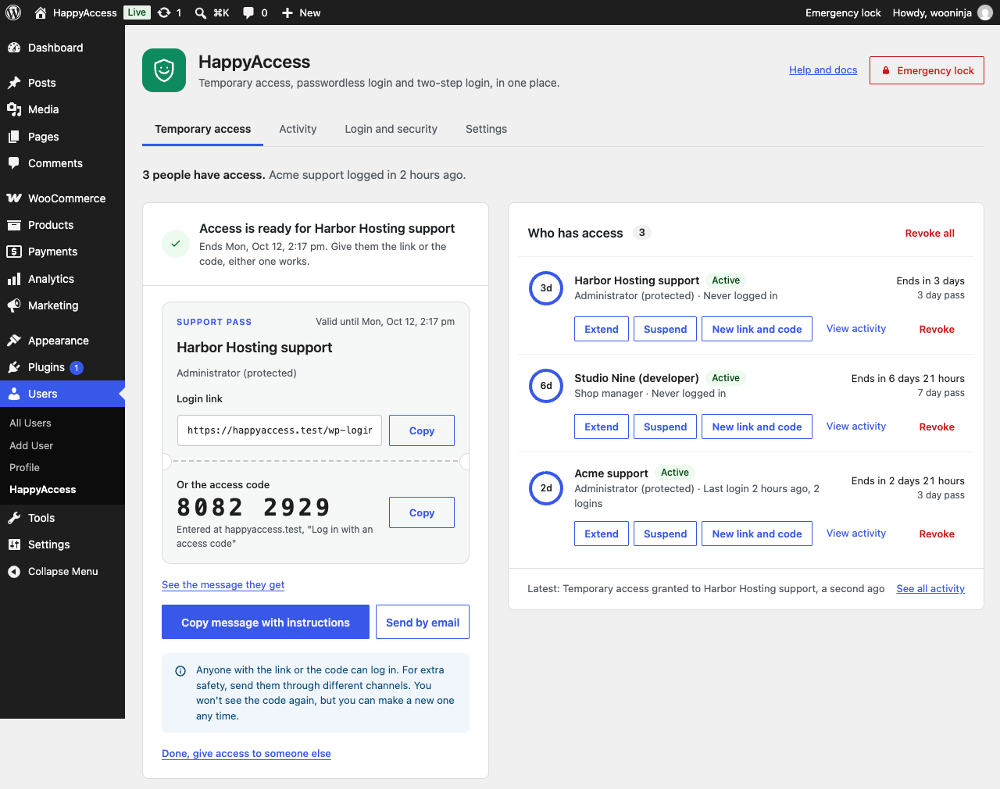
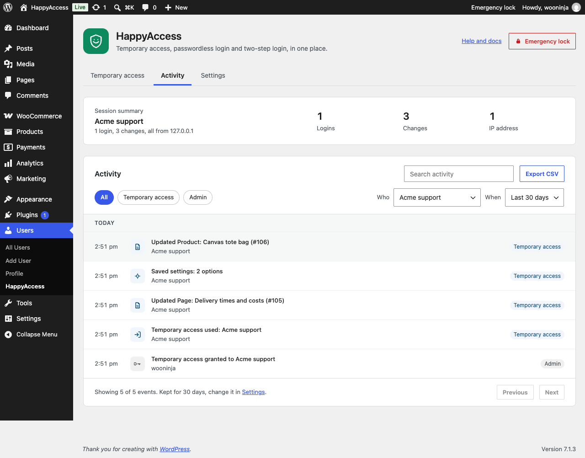
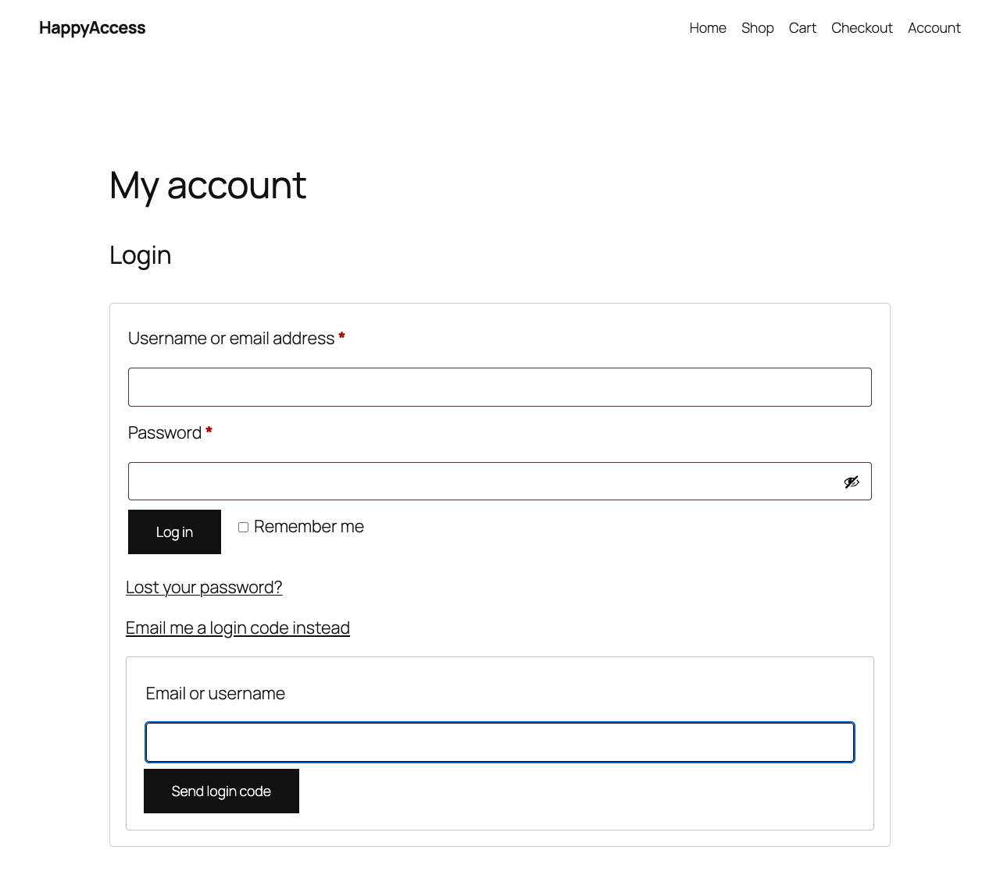
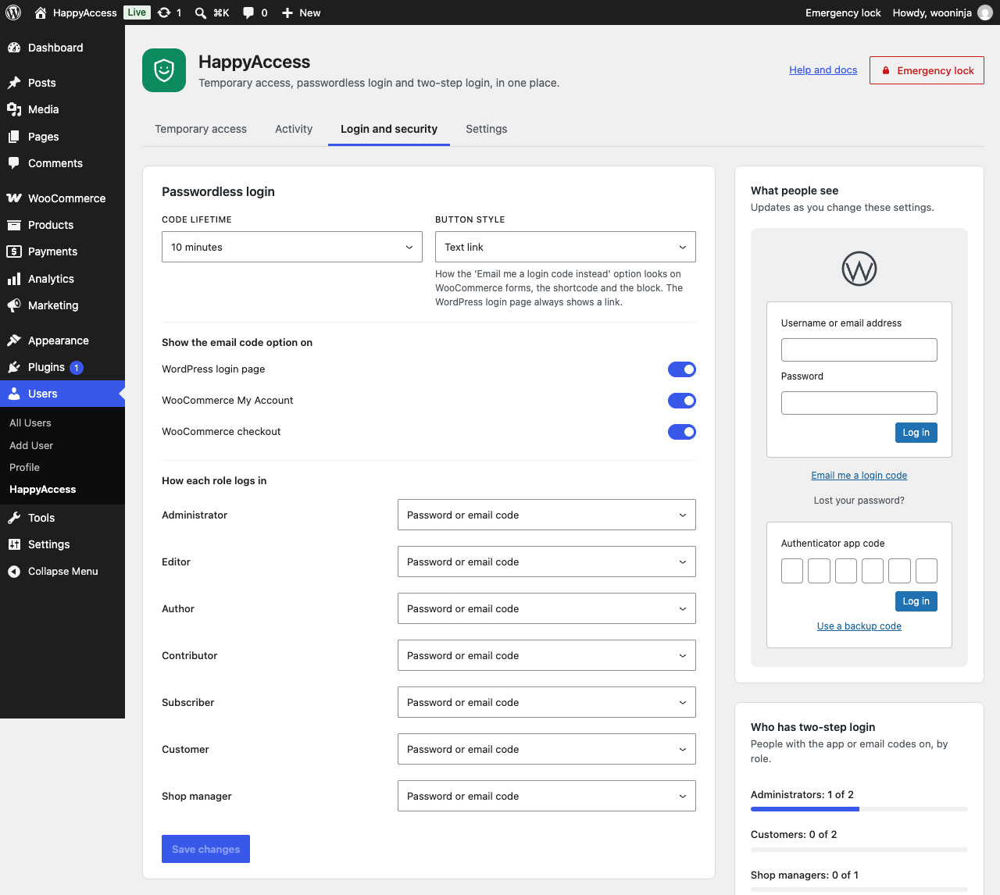
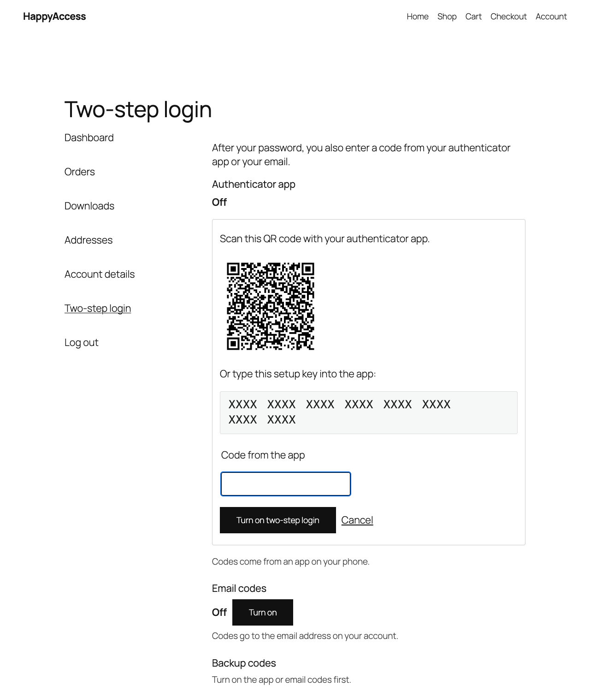
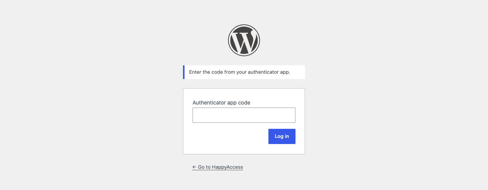

# HappyAccess: temporary login, passwordless login and 2FA for WordPress



HappyAccess is a free WordPress plugin that fixes the three login problems most WordPress and WooCommerce sites run into. It gives a support person temporary admin access without sharing a password, lets customers and users log in without a password using an email code or a login link, and adds two-step login (two-factor authentication, or 2FA) with an authenticator app, email codes or backup codes. Two-step login also emails your administrators when their account logs in from a new device.

[](https://wordpress.org/plugins/happyaccess/)
[](https://wordpress.org/plugins/happyaccess/)
[](https://wordpress.org/plugins/happyaccess/)
[](https://www.gnu.org/licenses/gpl-2.0.html)

Each feature is a switch in Settings. Turn on only what you need, and anything you leave off adds no code to your pages. There's no paid version and no account to sign up for. Install it from [WordPress.org](https://wordpress.org/plugins/happyaccess/).

Docs: the [HappyAccess docs](docs/README.md) cover setup, each feature, every way back in when someone is locked out, and the WP-CLI commands and hooks for developers.

## Watch it

[](https://www.youtube.com/watch?v=VtsEFprDkdM)

A 74-second look at temporary access, passwordless login, two-step login and new device alerts.

## Features

### Temporary admin access without a password

Someone from support needs to look at your site. The usual way is to make them an admin account, send a password by email, and promise to delete the account later. Most people forget, and the account stays forever.

With HappyAccess, you create a pass in Users > HappyAccess and send them the login link or the 8-digit code. They log in with it. When the time you picked is up, their sessions end and their account is removed by itself.


*Temporary access: give access in under a minute, and see who has access with a live countdown.*

- **You pick how long:** 1 day, 3 days, 7 days or your own range, up to 30 days.
- **You pick what they can do:** Protected admin (the default) is a full admin who can't install plugins, create other admins or touch your account. Custom access lets you tick exactly the permissions they need. Full admin has no limits, with an email alert on every login and a warning if they create another admin.
- **Safe links:** the login link opens a confirm screen first, so email and chat link scanners can't use it up.
- **Your choice of limits:** one-time passes, an IP address allowlist, and an email when they log in.
- **Stay in control:** suspend, extend or end a pass at any time. The Emergency lock in the admin bar ends every pass at once.
- **Your account stays private:** their account can't see or edit yours, and HappyAccess is hidden from their plugin list.
- **Their work stays:** posts they wrote move to your account when the access ends. Nothing they made is deleted.
- **For agencies and hosts:** WP-CLI commands to create, list, extend and end passes from the terminal.



*The login link and 8-digit code to send, right after you create a pass.*

#### See what the support person changed

The Activity tab lists every post, page, product, order, setting, plugin, theme and user a temporary user changed, with times and IP addresses. Export it as CSV.



*Activity: what the support person changed while they were in.*

### WordPress login without a password

Forgotten passwords are the most common login problem on any site with customers. Passwordless login lets people skip the password and log in with an email code or a magic login link instead.

1. They select "Email me a login code" on the login form and type their email or username.
2. They get one email with a 6-digit code and a login link. Both work for 10 minutes by default, and you can pick anything from 5 to 30.
3. They type the code, or open the link on any device, and they're in.



*Passwordless login on WooCommerce My Account: "Email me a login code instead".*

The email code option shows on:

- **The WordPress login page:** wp-login.php.
- **WooCommerce:** My Account and the classic WooCommerce checkout, inline with no page reload.
- **Any page:** with the HappyAccess Login block or the `[happyaccess_login]` shortcode.

It's built to be safe:

- **No account lookups:** the screen gives the same answer for an email that has an account and one that doesn't, so nobody can use it to find out who has an account.
- **Tied to one browser:** a code only works in the browser that asked for it, with 5 tries before it's cancelled.
- **One use:** login links can only be used once, and only from the confirm screen.
- **Per role:** keep "Password or email code", or switch a role to "Email code only".



*Login and security: passwordless and two-step settings with a live preview.*

### Two-factor authentication for WordPress and WooCommerce

Two-step login (also called two-factor authentication or 2FA) asks for a second code after the password. A stolen password alone isn't enough to get in.

- **Authenticator app:** works with any app that supports standard time-based codes (TOTP), like Google Authenticator, Microsoft Authenticator, Authy, 1Password and Bitwarden. Setup shows a QR code, drawn on your own site.
- **Email codes:** a 6-digit code sent to the account's email.
- **Backup codes:** 10 one-time codes for when the phone isn't around.
- **Optional or required per role:** for example required for administrators and shop managers, optional for customers.
- **A grace period:** required roles get a few logins or days to set it up, then it becomes part of their next login.
- **Setup where people already are:** on their WordPress profile, or in WooCommerce My Account for customers.
- **Never locked out:** an admin can turn it off from a user's profile, you can run `wp happyaccess twostep reset <user>`, or you can add one line to wp-config.php.
- **Plays nicely with others:** if Two Factor, Wordfence Login Security, WP 2FA or Kadence Security already protects an account, HappyAccess skips that account, so nobody is asked twice.



*Setting up two-step login from WooCommerce My Account with an authenticator app.*



*The two-step code step after the password.*

### New device login alerts

When an administrator's account logs in from a browser it hasn't used before, they get an email with the time, the browser, the system and the IP address. The email has a link to change their password if it wasn't them. You can turn alerts on for other roles in Login and security. New device alerts are part of two-step login, so they run while two-step login is on.

## For support teams, agencies and developers

If you support WordPress or WooCommerce sites, send this to a client when you need access. Copy it, change the names, and paste it into your ticket or email.

> Hi! To look into this, I need to log in to your site. You don't have to send me a password or make me an account.
>
> 1. Install the free HappyAccess plugin from your Plugins screen.
> 2. Go to Users > HappyAccess and create a pass. Three days is plenty.
> 3. Send me the link it shows you.
>
> My access ends by itself when the time is up, and you can end it earlier from the same screen. You'll also see what I changed while I was in.

## Install

1. In your dashboard, go to Plugins > Add New Plugin and search for "HappyAccess".
2. Install and activate it.
3. Go to Users > HappyAccess. Temporary access is on from the start.
4. To add passwordless login or two-step login, turn them on in the Settings tab, then set them up in Login and security.

HappyAccess needs WordPress 6.7 or later and PHP 7.4 or later. It's tested up to WordPress 7.1, and it works on multisite, network activated or per site.

## How it stays secure

HappyAccess hands out logins, so I built every part of it expecting someone to try to break in.

- **Codes are hashed:** access codes, login links and email codes are stored as hashes, never in plain text.
- **Secrets are encrypted:** authenticator app secrets are encrypted with your site's keys.
- **Rate limits:** wrong codes are limited per IP address and per account, and the owner gets an email if a site sees a lot of wrong codes.
- **A confirm screen for links:** opening a login link shows a confirm screen first. Only the button on that screen logs you in, so a link scanner in Outlook, Gmail or Slack can't use it up before the person does.
- **reCAPTCHA is optional:** Google reCAPTCHA v3 can check the access code screen, the login link screen and the email code forms. It's off until you add your own keys, and the two-step screens never use it.
- **Nothing sent out by default:** with reCAPTCHA off, HappyAccess keeps everything on your site and sends nothing anywhere.


*What the support person sees: a confirm screen before the login link logs them in.*

It also works with the plugins you already run:

- **Hidden login URLs:** works with WPS Hide Login and similar plugins, because every HappyAccess screen is a step of the normal WordPress login page.
- **Security plugins:** HappyAccess codes don't count as wrong passwords, so a brute force lockout won't lock anyone out over them.
- **Page cache:** every HappyAccess login screen tells caches not to store it.
- **Privacy tools:** WordPress's Export Personal Data and Erase Personal Data tools include HappyAccess data.

One thing to know: plugins that add their own checks to the password login, like user approval or country blocks, don't run on code and link logins.

## Frequently asked questions

### How do I give someone temporary admin access to my WordPress site?

Go to Users > HappyAccess, type who it's for, pick how long it lasts and what they can do, and create the pass. Send them the login link or the 8-digit code. Their access ends by itself at the time you picked.

### Can the support person see my password?

No. They log in with their own link or code, and their account is separate from yours. They never see or need your password.

### What happens when temporary access ends?

Their sessions end, they're logged out, and their temporary account is removed. Anything they wrote moves to your account and is never deleted. The activity log stays for as long as you keep logs (30 days by default).

### Is a login link the same as a magic link?

Yes. A login link (often called a magic link) logs someone in without a password. HappyAccess login links open a confirm screen first and only work once, so a link scanner in Outlook, Gmail or Slack can't use them up before the person does.

### How does passwordless login work with WooCommerce?

Turn on Passwordless login, and customers see "Email me a login code instead" under the login form on My Account and on the classic checkout. They type their email, get a 6-digit code, and log in without leaving the page. After logging in, they land back on My Account or the checkout.

### Which authenticator apps work with two-step login?

Any app that supports standard time-based one-time codes (TOTP, RFC 6238). That includes Google Authenticator, Microsoft Authenticator, Authy, 1Password, Bitwarden and most password managers.

### Can I require two-factor authentication for administrators only?

Yes. In Login and security, set each role to Off, Optional or Required. For example, Required for Administrator and Shop manager, and Optional for everyone else. Required roles get a grace period to set it up.

### Someone is locked out of two-step login. What do I do?

Pick whichever fits:

- **From their profile:** as an admin, open their profile and select "Turn off two-step login for this user".
- **From WP-CLI:** run `wp happyaccess twostep reset <user>`.
- **If it's you:** add `define( 'HAPPYACCESS_DISABLE_TWOSTEP', true );` to wp-config.php, log in, set it up again, then remove the line.

More answers are in the [FAQ on WordPress.org](https://wordpress.org/plugins/happyaccess/#faq).

## Development

You need PHP 7.4 or later, Composer, Node 22 (see `.nvmrc`) and MySQL or MariaDB. Clone the repo into `wp-content/plugins/happyaccess` and build the admin screen first, because the `build` folder isn't in git.

```
composer install
npm ci
npm run build
```

The PHPUnit suite needs WordPress and an empty test database. [CONTRIBUTING.md](CONTRIBUTING.md) has the full setup, the checks to run and the rules for pull requests.

## Security policy

Found a security issue? Please report it privately, not in a public issue or the support forum. The [security policy](SECURITY.md) explains how.

## Changelog

Version 1.1.0 rebuilt HappyAccess from the ground up and added passwordless login, two-step login and new device alerts. Every release is in [CHANGELOG.md](CHANGELOG.md).

## License

HappyAccess is licensed under the [GPL, version 2 or later](https://www.gnu.org/licenses/gpl-2.0.html).

The QR code on the two-step setup screen is drawn by [qrcode-generator](https://github.com/kazuhikoarase/qrcode-generator) by Kazuhiko Arase, under the MIT license.

## Why I made it

I'm Shameem Reza, a Happiness Engineer at Automattic, where I help WooCommerce store owners every day. Getting into the site was always the messy part. Someone makes an admin account, sends the password in an email, and promises to delete the account later. Most people forget, and the account stays.

HappyAccess started as my fix for that. You give support a link or a code instead of a password. The access ends when the time is up, and the account goes with it.

HappyAccess is my personal project. It isn't made or endorsed by Automattic.

## Links

- [HappyAccess on WordPress.org](https://wordpress.org/plugins/happyaccess/).
- [Docs](docs/README.md).
- [Support forum](https://wordpress.org/support/plugin/happyaccess/).
- [Security policy](SECURITY.md).
- [Contributing](CONTRIBUTING.md).
- [Changelog](CHANGELOG.md).
