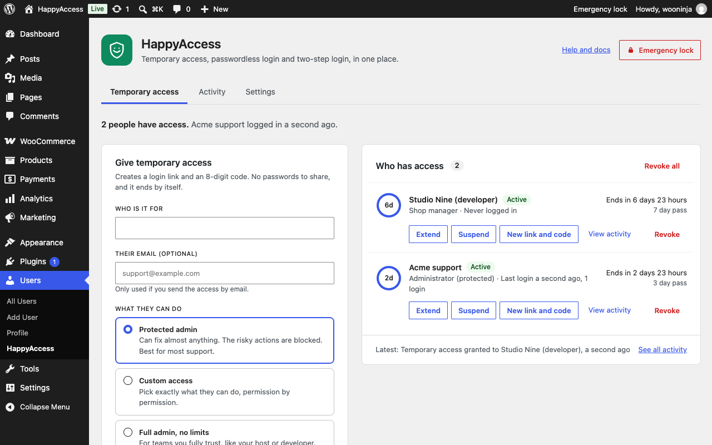

# Getting started

HappyAccess does three jobs: temporary access for support people, passwordless login, and two-step login. Each one is a switch, and anything you leave off adds no code to your pages.

HappyAccess needs WordPress 6.7 or later and PHP 7.4 or later.

## Install it

1. In your dashboard, go to Plugins > Add New Plugin and search for "HappyAccess".
2. Select Install Now, then Activate.
3. Go to Users > HappyAccess. The Settings link under HappyAccess on the Plugins screen opens the same page.

Only people who can manage the site's options (administrators, on most sites) see the page. Temporary support accounts never see it.

## Run the first setup

The first time you open Users > HappyAccess, a short setup runs before the tabs show.

1. On Features, tick what you want: Temporary access (ticked to start), Passwordless login and Two-step login. On a network where the main site decides two-step login, that choice doesn't show.
2. With Temporary access ticked, select Continue. On Consent, read the three points about what a support pass allows, tick "I understand, and I'll only give access to people I trust.", and select Finish setup. Without Temporary access there's no Consent step, so select Finish setup on Features.
3. On Done, pick where to go next. Each feature you turned on gets a button:
   - **Give temporary access** opens the Temporary access tab.
   - **Choose how each role logs in** opens the Login and security tab.
   - **Set up two-step login for your account** opens the two-step section of your profile.
   - **Choose who needs two-step login** opens the Login and security tab. It shows when Two-step login is on and Passwordless login is off.

Nothing is saved until you select Finish setup. If you skip Temporary access now and turn it on later in Settings, HappyAccess shows the same three points and the checkbox before it turns on.

## The four tabs

- **Temporary access:** create a pass, and see who has access with the time each pass has left. It shows while Temporary access is on.
- **Activity:** what temporary users did, plus logins, setting changes and other HappyAccess events. Filter it, search it and export it as CSV.
- **Login and security:** the passwordless and two-step settings, with a preview of what people see at login. It shows only while Passwordless login or Two-step login is on.
- **Settings:** the feature switches, the safety and privacy options, and reCAPTCHA.

The header has a Help and docs link back to these pages, and the Emergency lock button, which ends every pass at once.

## Turn features on and off

1. Go to Users > HappyAccess > Settings.
2. Under "What HappyAccess does on this site", switch Temporary access, Passwordless login or Two-step login on or off.

Each switch saves the moment you change it. A few changes ask first:

- **Turning Temporary access on for the first time:** if you skipped it in setup, HappyAccess shows the three consent points and the checkbox. Tick it and select Turn on.
- **Turning Temporary access off:** every current pass ends right away, so HappyAccess asks before it does it.
- **Turning Two-step login on while another two-step plugin is active:** HappyAccess names the plugin and asks before it turns on. See [other two-step plugins](two-step-login.md#other-two-step-plugins).

Once Passwordless login or Two-step login is on, set it up in the Login and security tab. See [Passwordless login](passwordless-login.md) and [Two-step login](two-step-login.md).

## Safety and privacy options

The rest of the Settings tab waits for Save changes.

- **Wrong codes before a pause:** how many wrong codes an IP address can try before it has to wait. The choices are 5 tries then 30 minutes (the default), 3 tries then 30 minutes, and 10 tries then 15 minutes.
- **Keep activity for:** 30 days (the default), 90 days or 1 year. Older log entries are deleted once an hour.
- **Visitor IP comes from:** leave it on Direct connection unless your site sits behind a proxy. Behind Cloudflare, pick Cloudflare. Behind another proxy or load balancer, pick the header it sets, X-Forwarded-For or X-Real-IP. Pick any of these only if your server accepts traffic from that proxy alone, or visitors can fake their IP address. HappyAccess reads X-Forwarded-For from the right, so the nearest public address wins.
- **Default pass length:** how long a pass lasts when nothing else sets it, for example `wp happyaccess grant` without `--expires`. The form on the Temporary access tab starts at it too: on 1 day, 3 days or 7 days when it matches one, or on Custom with that length.
- **Shorten IP addresses in the log:** stores 203.0.113.0 instead of 203.0.113.42, and cuts IPv6 addresses the same way.
- **Keep a log:** turning it off also stops the record of what support people change.
- **Delete all HappyAccess data when the plugin is deleted:** off by default. Passes always end when you delete the plugin. With this on, the tables, settings and user data go too.
- **reCAPTCHA:** an optional Google check on the access code, login link and email code screens. It's off until you add your own keys. See [Privacy and security](privacy-and-security.md#outside-services).

## Next steps

- [Give someone temporary access](temporary-access.md).
- [Set up passwordless login](passwordless-login.md).
- [Set up two-step login](two-step-login.md).
